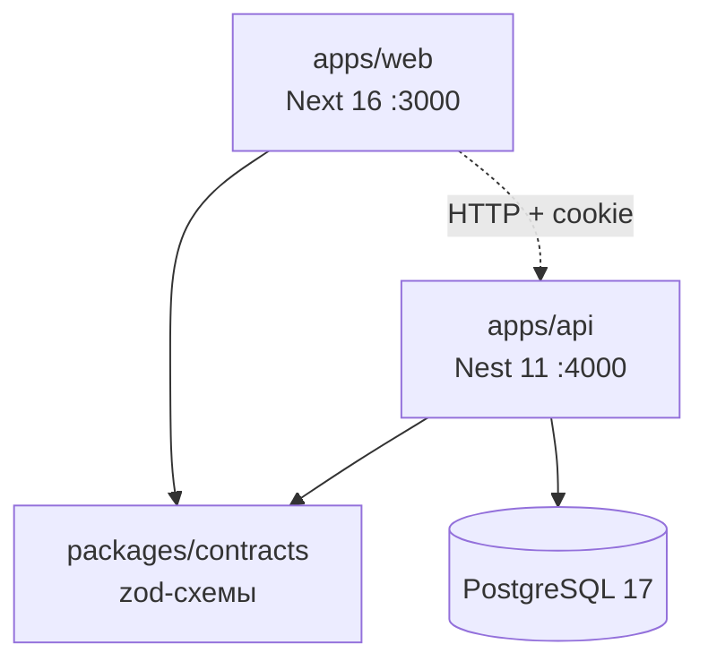
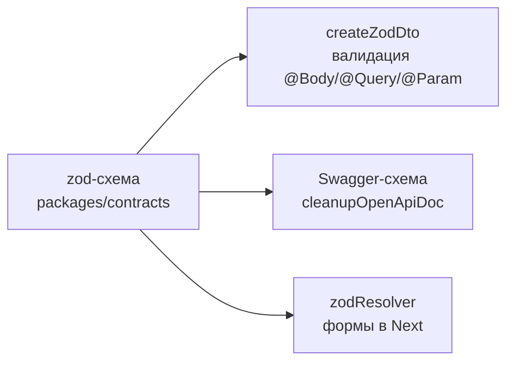
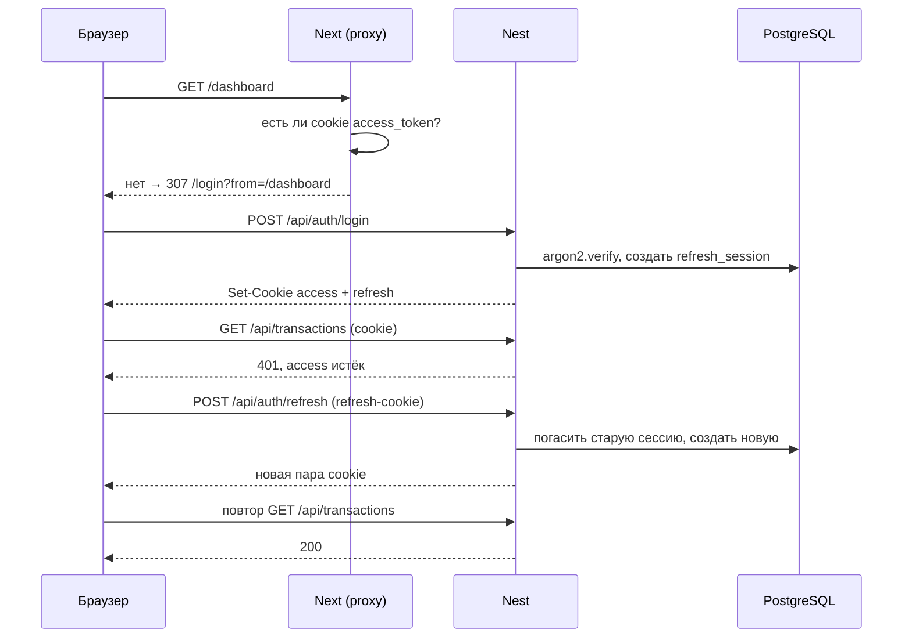

# Архитектура

Как устроен репозиторий целиком: из чего он собран, кто от кого зависит и что происходит с
запросом от клика в браузере до строки в PostgreSQL. Процесс работы — в
[developer-guide.md](developer-guide.md), поштучное описание ручек — в [api.md](api.md),
поля таблиц — в [database.md](database.md).

## Карта репозитория

pnpm workspaces + Turborepo, пять пакетов:

| Пакет                    | Роль                                                                    | Порт |
| ------------------------ | ----------------------------------------------------------------------- | ---- |
| `apps/web`               | Next 16 (App Router, Turbopack), Tailwind v4, TanStack Query, shadcn/ui | 3000 |
| `apps/api`               | Nest 11, REST + Swagger, Prisma 7, PostgreSQL                           | 4000 |
| `packages/contracts`     | zod-схемы и типы DTO, общие для обеих сторон                            | —    |
| `packages/eslint-config` | flat-конфиги ESLint (`base`, `nest`, `next`)                            | —    |
| `packages/tsconfig`      | пресеты tsconfig (`base`, `nest`, `next`)                               | —    |



Стрелка `web → api` пунктирная не случайно: сборочной зависимости между приложениями нет,
они связаны только контрактом и HTTP. Общий код между ними может жить **только** в
`packages/contracts` — импортировать что-то из `apps/api` в `apps/web` нельзя.

## Контракт — единственный источник правды

Все DTO описаны zod-схемами в `packages/contracts/src`. Оттуда одно описание расходится в
три места:



- **Nest**: `createZodDto(schema)` в `dto.ts` каждого модуля, глобальный `ZodValidationPipe`
  (`APP_PIPE` в `app.module.ts`) проверяет по нему тело, query и параметры пути.
- **Swagger**: схемы выводятся из тех же zod-описаний, `cleanupOpenApiDoc()` в `main.ts`
  приводит их к валидному OpenAPI.
- **Next**: те же схемы работают в формах через `@hookform/resolvers/zod`.

Меняете форму запроса или ответа — правьте схему в `packages/contracts`, а не DTO в модуле.
Для контрактов ломающей считается любая правка формы: её сразу видят оба приложения,
поэтому такой коммит помечается `!` и абзацем `BREAKING CHANGE`.

**Файлы контрактов:** `common.ts` (пагинация, валюты, суммы, `idParamSchema`), `auth.ts`,
`category.ts`, `transaction.ts`. Всё реэкспортируется через `index.ts`.

### Contracts собирается в dist, и это влияет на порядок задач

Пакет компилируется `tsc` в CommonJS (`dist` + `.d.ts`), поэтому Nest (CJS) и Next
потребляют его без `transpilePackages` и хаков с `rootDir`. Цена: **правки в контрактах не
видны приложениям до пересборки.** Поэтому у `dev`, `build`, `lint` и `typecheck` в
`turbo.json` стоит `dependsOn: ["^build"]`, а при ручном запуске одного приложения рядом
нужно держать `pnpm --filter @expence/contracts dev`.

## Backend: слои

```
HTTP → helmet → cookie-parser → CORS
     → ThrottlerGuard (APP_GUARD)      120 req/min
     → JwtAuthGuard   (APP_GUARD)      закрыто по умолчанию, @Public() открывает
     → ZodValidationPipe (APP_PIPE)    проверка @Body/@Query/@Param по контракту
     → Controller                      разбор запроса, вызов сервиса
     → Service                         бизнес-логика, проверки владельца
     → PrismaService                   SQL
     ← Mapper                          Prisma-строка → форма контракта
     ← AllExceptionsFilter             P2002 → 409, P2025 → 404, прочее → 500 + лог
```

Всё глобальное собрано в двух файлах: `app.module.ts` (пайп и два гварда через
`APP_PIPE`/`APP_GUARD`) и `main.ts` (helmet, cookie-parser, CORS с `credentials: true`,
глобальный префикс `/api`, фильтр исключений, Swagger, shutdown hooks).

**Модули:** `auth`, `users`, `categories`, `transactions`, `health`, плюс глобальный
`PrismaModule`.

Внутри модуля файлы всегда одни и те же: `*.module.ts`, `*.controller.ts`, `*.service.ts`,
`dto.ts` (обёртки `createZodDto`), `*.mapper.ts`.

### Три соглашения, которые держат бэкенд однородным

1. **Мапперы не знают о Prisma.** `*.mapper.ts` принимают структурные `*Like`-интерфейсы
   (`TransactionLike`, `CategoryLike`, `UserLike`), а не сгенерированные типы. Поэтому
   маппер одинаково берёт и результат `findMany`, и подгруженную связь.
2. **Валидация ответов сознательно выключена.** `ZodSerializerInterceptor` не подключён:
   форму ответа гарантируют мапперы (`Date` → ISO-строка, `Decimal` → строка). Включите
   интерсептор — мапперы станут обязательными везде.
3. **Владелец проверяется в сервисе, а не гвардом.** Каждый метод принимает `userId`
   первым аргументом и подмешивает его в `where`. Чужая запись неотличима от
   несуществующей, поэтому наружу уходит 404, а не 403: иначе по коду ответа можно было бы
   перебором нащупать чужие id.

### Слой репозитория есть только у users

`modules/users` — единственный модуль с разделением: `UsersRepository` инкапсулирует
Prisma, `UsersService` — тонкий фасад, наружу экспортируется только сервис. В
`categories`/`transactions` сервисы ходят в `PrismaService` напрямую, доступ к
`refresh_sessions` из `AuthService` — тоже. Неоднородность осознанная; будете вводить
репозитории дальше — ориентируйтесь на `users.repository.ts`.

Вместе с `PrismaService` репозиторий пользователей — единственные места, импортирующие
`src/generated/prisma`.

## Frontend: Feature-Sliced Design

Слои сверху вниз: `app` → `views` → `widgets` → `features` → `entities` → `shared`.
Импортировать можно только вниз и только через публичный API среза (`index.ts`).

Две адаптации под App Router:

- **`src/app` — одновременно роутер Next и слой `app` FSD.** Отдельного каталога для слоя
  нет: рядом с `layout.tsx`/`page.tsx` лежат `providers.tsx` и `globals.css`.
- **Слой `pages` называется `views`**, потому что имя `pages` в Next занято Pages Router.
  `page.tsx` роутера — тонкая обёртка: `metadata` плюс рендер компонента из `views`.

| Слой       | Что внутри                                                                                                                            |
| ---------- | ------------------------------------------------------------------------------------------------------------------------------------- |
| `views`    | `login`, `register`, `dashboard`, `transactions`, `categories`, `terms`, `privacy`                                                    |
| `widgets`  | `app-nav` (тёмная рельса и мобильная шапка), `month-summary`, `expense-breakdown`, `transaction-list`, `category-list`, `create-menu` |
| `features` | `auth/{login,register,logout}`, `category/{category-form,delete-category}`, `transaction/{transaction-form,delete-transaction}`       |
| `entities` | `session`, `category`, `transaction` — запросы, ключи кэша, хуки над `useQuery`, атомарный UI                                         |
| `shared`   | `api/client.ts`, `config/{env,routes,session}`, `lib/{utils,format,redirect}`, `ui`                                                   |

Оболочка приложения собрана в `src/app/(dashboard)/layout.tsx`: тёмная рельса `AppSidebar`
(прилипает к верху окна, ниже `lg` подменяется горизонтальной `AppTopbar`) и колонка
содержимого лежат в одной скруглённой панели, а панель — на градиентном холсте из
`--canvas-image`. Экраны входа и правовых документов используют ту же панель без навигации,
поэтому марка `AppBrand` тоже экспортируется из `app-nav`.

Направление импортов проверяет `no-restricted-imports` в `apps/web/eslint.config.mjs`:
запрещён импорт вверх по слоям и в соседний срез того же слоя. `shared` — исключение:
у него нет срезов, только сегменты, и они друг о друге знают.

**Единая точка выхода в сеть** — `shared/api/client.ts`: `fetch` с `credentials: 'include'`,
разбор ошибок в `ApiError`, автоматический refresh при 401. Всё остальное ходит в API
только через него.

## Аутентификация end-to-end

Оба токена лежат в httpOnly cookie, которые ставит API на порту 4000. Браузер не различает
порты, поэтому на 3000 они видны.

| Cookie          | Путь        | Срок                                                                       |
| --------------- | ----------- | -------------------------------------------------------------------------- |
| `access_token`  | `/`         | сессионная, срок определяет сам JWT (`ACCESS_TOKEN_TTL`, по умолчанию 15m) |
| `refresh_token` | `/api/auth` | `REFRESH_TOKEN_TTL_DAYS` (по умолчанию 30)                                 |

Refresh-cookie ограничена путём `/api/auth` — браузер не прикладывает её к обычным
запросам.



Деление ответственности жёсткое: **сервер решает, валиден ли токен, а веб может проверить
только факт наличия cookie** — значение httpOnly ему недоступно. Поэтому `apps/web/src/proxy.ts`
(в Next 16 middleware переименован в proxy) делает лишь грубую отсечку и передаёт исходный
путь в `?from=`; настоящую проверку делает `JwtAuthGuard`.

**Ротация и детекция утечки.** `AuthService.rotateTokens` гасит старую сессию и выдаёт
новую пару. Повторное использование уже отозванного токена трактуется как утечка — гасятся
**все** живые сессии пользователя. В БД лежит `sha256` от refresh-токена: сам токен
не восстановить, сверка дешёвая.

**`User.lastLoginAt` пишется в одном месте** — `AuthService.issueTokens`. Это единственный
путь выдачи пары токенов, поэтому одна отметка покрывает register, login и refresh.

## Деньги

В БД `Decimal(12,2)`. Наружу сумма отдаётся **строкой** — иначе по пути к клиенту появился
бы float и потерялась бы точность на больших суммах. На входе контрактная схема даёт
`z.coerce.number()` с ограничением двух знаков.

Отсюда два следствия: на клиенте арифметики над суммами нет (только форматирование через
`shared/lib/format`), а в сводке за месяц сервер складывает **копейки** — целые числа, —
иначе разница доходов и расходов давала бы хвост вида `0.30000000000000004`.

## Границы, которые легко сломать

- **TypeScript закреплён на 5.9.3**: `typescript-eslint@8` объявляет `typescript: >=4.8.4 <6.1.0`.
  Bump TS — только вместе с мажором typescript-eslint.
- **ESLint закреплён на 9.39.5, до 10 поднимать нельзя**: `eslint-config-next@16` тянет
  `eslint-plugin-react@7.37`, который на ESLint 10 падает и линт веба не запускается.
- **`eslint-config-next` живёт только в `packages/eslint-config`**, и `next.mjs` намеренно
  не композитится с `base.mjs`: конфиг Next уже подключает typescript-eslint и react-hooks,
  а повторное определение плагина в flat-config — ошибка.
- **В `apps/api` нет path-алиасов**, только относительные импорты: `nest build`/`tsc` не
  переписывают `paths` в выходном JS. В `apps/web` алиас `@/*` есть и работает через бандлер.
- `pnpm-workspace.yaml` держит `onlyBuiltDependencies` для `prisma`, `argon2`,
  `@tailwindcss/oxide` — иначе pnpm 10 блокирует их postinstall.
- **Версии зависимостей закреплены точно, без `^`.**
