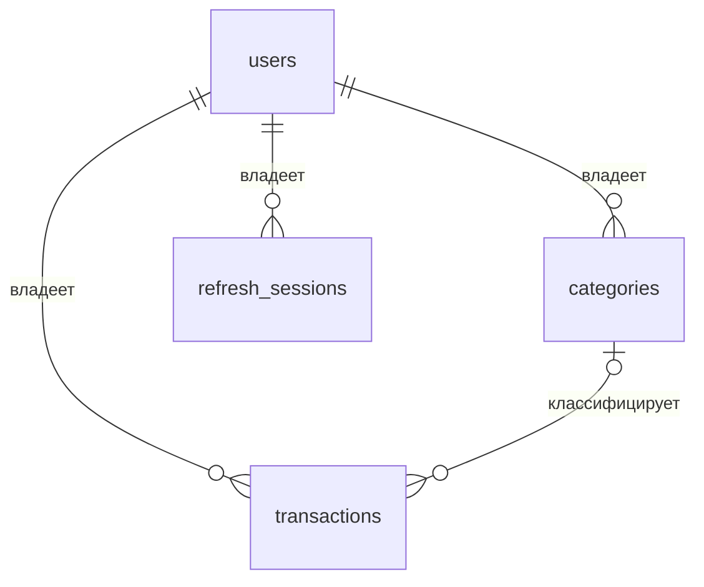
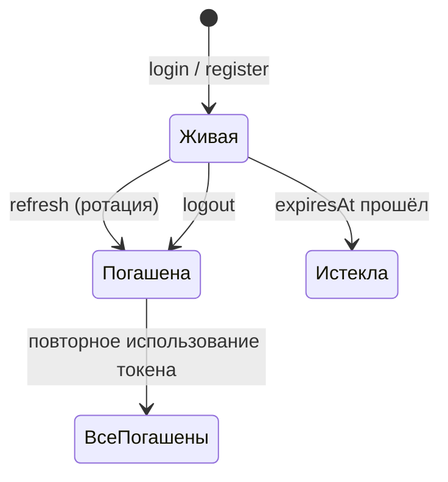

# Схема БД

PostgreSQL 17, Prisma 7. Схема — `apps/api/prisma/schema.prisma`, миграции —
`apps/api/prisma/migrations`. Здесь разобрано назначение каждого поля и решения, которых
не видно в самой схеме. Ручки, которые эти таблицы читают, — в [api.md](api.md).

## Общая картина



Четыре таблицы и один enum. Всё, что принадлежит пользователю, привязано к нему напрямую:
промежуточных сущностей вроде «счёт» или «кошелёк» в модели нет.

**Общие соглашения:**

- **Первичный ключ везде `uuid`** (`@db.Uuid`), а не автоинкремент: id уходят в URL и в
  тела запросов, а последовательный числовой ключ выдавал бы объём базы и позволял
  перебирать чужие записи.
- **`createdAt`/`updatedAt`** есть у всех сущностей, кроме `refresh_sessions` (там своя
  временная логика). `updatedAt` заполняет Prisma (`@updatedAt`), не БД.
- **Имена таблиц — snake_case во множественном числе** (`@@map`), имена полей в коде —
  camelCase. Это касается и enum: `TransactionType` → `transaction_type`.
- **Мягкого удаления нет.** `DELETE` физически удаляет строку.

---

## `users`

Учётная запись. Единственная таблица, которую не ограничивают чужим `userId` — она сама
корень владения.

| Поле           | Тип           | Назначение                                                                                                                                                                                                                                    |
| -------------- | ------------- | --------------------------------------------------------------------------------------------------------------------------------------------------------------------------------------------------------------------------------------------- |
| `id`           | `uuid` PK     | Идентификатор. Уходит в `sub` JWT.                                                                                                                                                                                                            |
| `email`        | `text` UNIQUE | Логин. Приводится к нижнему регистру **схемой контракта** (`toLowerCase()`), не БД, — коллация в PostgreSQL регистрозависимая, и без нормализации на входе `User@mail` и `user@mail` были бы разными аккаунтами.                              |
| `passwordHash` | `text`        | argon2id-хеш. Наружу не отдаётся никогда: `toAuthUser` его не переносит.                                                                                                                                                                      |
| `name`         | `text?`       | Отображаемое имя. Необязательно: регистрация проходит и без него.                                                                                                                                                                             |
| `lastLoginAt`  | `timestamp?`  | Последняя выдача пары токенов — register, login или refresh. **Телеметрия**, а не инвариант: в контракт `authUserSchema` не входит и наружу не отдаётся. Пишется в одном месте — `AuthService.issueTokens`, единственном пути выдачи токенов. |
| `createdAt`    | `timestamp`   | Дата регистрации. Отдаётся клиенту.                                                                                                                                                                                                           |
| `updatedAt`    | `timestamp`   | Служебное.                                                                                                                                                                                                                                    |

**Связи:** `categories`, `transactions`, `sessions` — все с `onDelete: Cascade`. Удаление
пользователя уносит все его данные; отдельной процедуры очистки не нужно.

---

## `categories`

Пользовательская категория операций. Справочника «системных» категорий нет: у каждого
пользователя свой набор, стартовый насыпают сиды.

| Поле        | Тип         | Назначение                                                                                                                                |
| ----------- | ----------- | ----------------------------------------------------------------------------------------------------------------------------------------- |
| `id`        | `uuid` PK   |                                                                                                                                           |
| `userId`    | `uuid` FK   | Владелец. Cascade от `users`.                                                                                                             |
| `name`      | `text`      | Название, 1–60 символов (ограничение в контракте, не в БД).                                                                               |
| `color`     | `text?`     | HEX вида `#1f2937` для метки в интерфейсе. Формат проверяет контракт.                                                                     |
| `icon`      | `text?`     | Имя иконки lucide (`shopping-cart`, `bus`). Строка, а не enum: набор иконок — дело фронтенда, и расширять его миграцией было бы неудобно. |
| `createdAt` | `timestamp` |                                                                                                                                           |
| `updatedAt` | `timestamp` |                                                                                                                                           |

**Ограничения и индексы:**

- `@@unique([userId, name])` — имя уникально **в пределах пользователя**, а не глобально.
  Нарушение даёт `P2002`, который `AllExceptionsFilter` превращает в 409.
- `@@index([userId])` — под основной запрос: «все категории пользователя».

**Связь с транзакциями — `onDelete: SetNull`.** Удаление категории не удаляет операции: у
них проставляется `categoryId = NULL`, и они попадают в группу «без категории». Каскад
здесь был бы разрушительным — пользователь потерял бы историю трат, переименовывая
рубрикатор.

---

## `transactions`

Доход или расход. Тип различает знак операции, всё остальное общее — отдельных таблиц для
доходов и расходов нет.

| Поле         | Тип                | Назначение                                                                                                                                            |
| ------------ | ------------------ | ----------------------------------------------------------------------------------------------------------------------------------------------------- |
| `id`         | `uuid` PK          |                                                                                                                                                       |
| `userId`     | `uuid` FK          | Владелец. Cascade от `users`.                                                                                                                         |
| `categoryId` | `uuid?` FK         | Категория. Необязательна — операция без категории легальна и попадает в сводку в группу `null`.                                                       |
| `amount`     | `Decimal(12,2)`    | Сумма, **всегда положительная**: знак задаёт `type`. Потолок — 10 знаков до запятой. Наружу отдаётся строкой.                                         |
| `type`       | `transaction_type` | `INCOME` или `EXPENSE`. Дефолт `EXPENSE` нужен был, чтобы записи, заведённые до появления типа, стали расходами.                                      |
| `currency`   | `varchar(3)`       | Код валюты, дефолт `RUB`. Строка, а не enum БД: добавление валюты не должно требовать миграции. Допустимый набор (`RUB`/`USD`/`EUR`) держит контракт. |
| `occurredAt` | `timestamp`        | **Когда операция произошла** — то, что вводит пользователь. Именно по нему идут фильтры, сортировка и границы месяца в сводке.                        |
| `note`       | `text?`            | Комментарий, ≤ 500 символов (ограничение в контракте).                                                                                                |
| `createdAt`  | `timestamp`        | **Когда запись создана** — служебное. Используется как вторичный ключ сортировки при одинаковом `occurredAt`.                                         |
| `updatedAt`  | `timestamp`        |                                                                                                                                                       |

**`occurredAt` против `createdAt` — не дубль.** Пользователь может завести вчерашнюю
покупку сегодня: тогда `occurredAt` вчера, `createdAt` сегодня. Список сортируется по
`occurredAt DESC`, при равенстве — по `createdAt DESC`, чтобы порядок был устойчивым.

**Индексы:**

| Индекс                          | Под какой запрос                                              |
| ------------------------------- | ------------------------------------------------------------- |
| `@@index([userId, occurredAt])` | Список и сводка: всегда фильтр по владельцу плюс диапазон дат |
| `@@index([userId, type])`       | Фильтр по типу и `groupBy` в сводке                           |
| `@@index([categoryId])`         | Фильтр по категории и `SetNull` при её удалении               |

Уникального ключа у транзакции нет — и это осознанно: две одинаковые покупки в один день
законны. Отсюда следствие для сидов: `upsert` к транзакциям неприменим, повторный запуск
просто наплодил бы дубли, поэтому сиды вставляют операции только в пустой список.

### Почему `Decimal(12,2)`, а не float или integer

`float` теряет точность на больших суммах и даёт хвосты вида `0.30000000000000004` при
сложении. `integer` в копейках потребовал бы конвертации на каждом чтении и записи.
`Decimal(12,2)` хранит ровно то, что ввёл пользователь.

Цена решения: Prisma отдаёт `Decimal`-объект, а не число. Поэтому **наружу сумма уходит
строкой** (`amount.toFixed(2)` в маппере) — если сериализовать `Decimal` в JSON как число,
float появится уже на клиенте. А в сводке сервер складывает **копейки** (целые числа) и
переводит обратно в строку только в конце: `Decimal(12,2)` — это меньше 10¹² копеек, что
заметно ниже `MAX_SAFE_INTEGER`.

---

## `refresh_sessions`

Одна запись = один выданный refresh-токен. Таблица нужна ровно для двух вещей: ротации и
отзыва — без неё JWT нельзя было бы погасить до истечения срока.

| Поле        | Тип          | Назначение                                                                                                                           |
| ----------- | ------------ | ------------------------------------------------------------------------------------------------------------------------------------ |
| `id`        | `uuid` PK    | **Не `@default(uuid())`**: id генерирует приложение (`randomUUID()`), потому что то же значение уходит в claim `sid` refresh-токена. |
| `userId`    | `uuid` FK    | Владелец. Cascade от `users`.                                                                                                        |
| `tokenHash` | `text`       | `sha256` от токена. Сам токен не хранится: по базе его не восстановить, а сверка при ротации дешёвая.                                |
| `userAgent` | `text?`      | User-Agent запроса — чтобы отличать устройства в списке сессий.                                                                      |
| `ip`        | `text?`      | IP запроса. Той же цели.                                                                                                             |
| `expiresAt` | `timestamp`  | Срок жизни, `REFRESH_TOKEN_TTL_DAYS` от выдачи. Проверяется при ротации явно, не только подписью JWT.                                |
| `revokedAt` | `timestamp?` | `NULL` — сессия жива. Заполнено — погашена: ротацией, логаутом или детекцией утечки.                                                 |
| `createdAt` | `timestamp`  |                                                                                                                                      |

**Индексы:** `@@index([userId])` — «все сессии пользователя», нужен при массовом гашении.
`@@index([expiresAt])` — под будущую чистку протухших записей (самой чистки пока нет,
см. ниже).

### Жизненный цикл сессии



**Ротация.** Каждый `refresh` гасит текущую запись (`revokedAt = now()`) и создаёт новую с
новым `id`. Один refresh-токен срабатывает ровно один раз.

**Детекция утечки.** Если приходит токен от уже погашенной сессии, это значит, что им
владеет кто-то ещё: гасятся **все** живые сессии пользователя (`revokedAt IS NULL`), а не
только эта. Логика — в `AuthService.rotateTokens`.

**Чего в таблице нет:** фонового удаления истёкших записей. Строки копятся, `revokedAt` их
только помечает. Для учебного проекта это допустимо; на реальной нагрузке понадобится
периодическая чистка по `expiresAt` — индекс под неё уже есть.

---

## Enum `transaction_type`

```prisma
enum TransactionType {
  INCOME
  EXPENSE
  @@map("transaction_type")
}
```

Единственный enum на уровне БД. Валюта им намеренно не сделана: набор валют меняется чаще,
чем набор «доход/расход», и правка enum в PostgreSQL требует миграции.

Значения перечислены ещё раз в контракте (`TRANSACTION_TYPES` в
`packages/contracts/src/transaction.ts`) — дублирование вынужденное: контракты не должны
зависеть от сгенерированного Prisma-клиента. Расширяете enum — правьте оба места.

---

## Миграции

Применены три:

| Миграция                                  | Что сделала                                                          |
| ----------------------------------------- | -------------------------------------------------------------------- |
| `20260825110237_init`                     | Базовая схема: `users`, `categories`, `expenses`, `refresh_sessions` |
| `20260825115707_user_last_login_at`       | Добавила `users.lastLoginAt`                                         |
| `20260831133953_expenses_to_transactions` | Переименовала `expenses` → `transactions`, добавила `type` и enum    |

**Третья миграция — образец ручной правки.** Prisma разворачивает переименование модели в
`DROP` + `CREATE` и теряет данные: отличить переименование от «удалили одно, добавили
другое» она не умеет. Поэтому миграция создавалась через `--create-only`, а SQL заменялся
на `ALTER TABLE ... RENAME` вручную. Если будете переименовывать модель — делайте так же и
применяйте через `prisma migrate deploy`: в непустой БД `migrate dev` спросит
подтверждение, а в неинтерактивной среде просто упадёт.

**Порядок команд важен:** `pnpm db:migrate`, потом `pnpm db:generate`. В отличие от
Prisma 6, `migrate dev` клиент не генерирует. Обратный порядок научит клиент селектить
колонку, которой в БД ещё нет, и запросы начнут падать в рантайме.

**Проверка дрейфа схемы:**

```bash
pnpm --filter api exec prisma migrate diff \
  --from-schema prisma/schema.prisma --to-config-datasource --exit-code
```

Флаги в Prisma 7 переименованы: `--from-schema-datamodel` → `--from-schema`, вместо
`--to-url` — `--to-config-datasource`.

## Особенности Prisma 7 в этом проекте

- **Строка подключения — в `apps/api/prisma.config.ts`**, у `datasource` в `schema.prisma`
  только `provider`.
- **Генератор `prisma-client`** (не `prisma-client-js`), вывод в
  `apps/api/src/generated/prisma`, `moduleFormat = "cjs"` обязателен — Nest компилируется в
  CommonJS. Каталог в `.gitignore`, в индекс попадать не должен.
- **Driver adapter обязателен:** `new PrismaClient()` без него бросает ошибку. `PrismaService`
  передаёт `new PrismaPg({ connectionString })`.
- **Сгенерированный клиент компилируется как часть `src`**, поэтому в `apps/api/tsconfig.json`
  выключен `noUncheckedIndexedAccess` — в остальных пакетах он включён.
- Сиды настраиваются через `migrations.seed` в `prisma.config.ts`, а не полем `prisma` в
  `package.json`.

## Демо-данные

`pnpm db:seed` (`apps/api/prisma/seed.ts`) создаёт:

- пользователя `demo@expence.local` / `demo12345`;
- пять категорий (Продукты, Транспорт, Жильё, Развлечения, Здоровье) с цветами и иконками;
- 13 операций за текущий месяц и 10 за прошлый.

Операций больше страницы списка (на главном экране — 10), чтобы сразу была видна
пагинация, а сводка за месяц не была пустой. Даты ставятся на **полдень UTC**: в БД
`timestamp(3)` без зоны, и края суток при пересчёте в локальное время уехали бы в соседний
день.

Пользователь и категории заводятся через `upsert` — сиды идемпотентны. Транзакции
вставляются только если их у демо-пользователя нет вообще (уникального ключа у них нет,
`upsert` неприменим).
